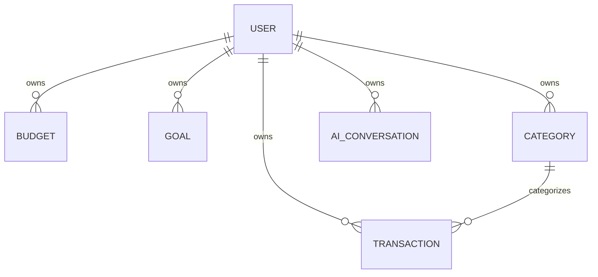
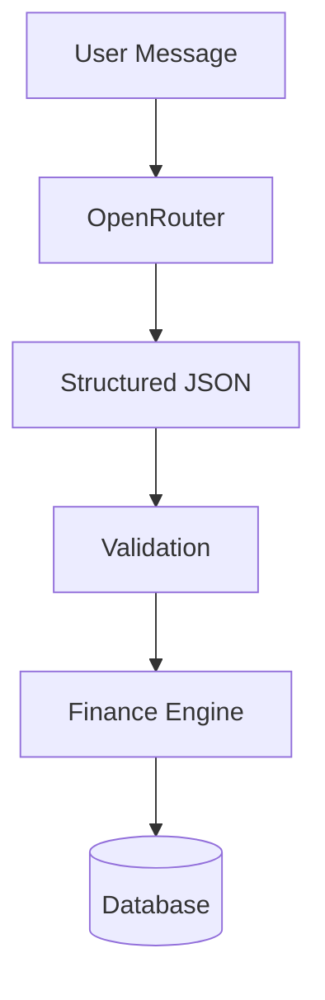

# API & Database Design

# Budgetly

Version: 1.0

Status: Draft

---

# 1. Introduction

This document defines the backend architecture of Budgetly.

It specifies:

- Database Schema
- Entity Relationships
- API Design
- Authentication Flow
- Authorization Rules
- Validation
- Error Handling
- File Storage
- AI Integration

This document serves as the reference for backend implementation.

---

# 2. Backend Overview

Budgetly follows a layered backend architecture.

```mermaid
flowchart TD

A[Client]

B[API Route]

C[Authentication]

D[Validation]

E[Service]

F[Finance Engine]

G[Prisma ORM]

H[(PostgreSQL)]

A --> B
B --> C
C --> D
D --> E
E --> F
F --> G
G --> H
```



Every request follows this lifecycle.

---

# 3. Database Design

## Core Tables

### Users

Stores account information.

| Field | Type |
|--------|------|
| id | UUID |
| name | String |
| email | String |
| passwordHash | String |
| profileImage | String |
| preferredLanguage | String |
| preferredCurrency | String |
| theme | String |
| createdAt | Timestamp |
| updatedAt | Timestamp |

---

### Categories

Stores transaction categories.

Examples

- Food
- Transport
- Shopping
- Salary
- Entertainment
- Healthcare
- Education

Fields

| Field | Type |
|--------|------|
| id | UUID |
| userId | UUID |
| name | String |
| icon | String |
| color | String |

---

### Transactions

Stores income and expenses.

| Field | Type |
|--------|------|
| id | UUID |
| userId | UUID |
| categoryId | UUID |
| amount | Decimal |
| type | Income / Expense |
| title | String |
| note | Text |
| transactionDate | Timestamp |
| receiptUrl | String |
| createdAt | Timestamp |
| updatedAt | Timestamp |

---

### Budgets

| Field | Type |
|--------|------|
| id | UUID |
| userId | UUID |
| categoryId | UUID |
| amount | Decimal |
| startDate | Date |
| endDate | Date |

---

### Goals

| Field | Type |
|--------|------|
| id | UUID |
| userId | UUID |
| title | String |
| targetAmount | Decimal |
| currentAmount | Decimal |
| deadline | Date |

---

### Notifications

Stores reminders and alerts.

---

### AI Conversations

Stores AI chat history.

| Field | Type |
|--------|------|
| id | UUID |
| userId | UUID |
| role | User / Assistant |
| message | Text |
| createdAt | Timestamp |

---

### User Settings

Stores user preferences.

Examples

- Theme
- Language
- Currency
- Notification Settings

---

# 4. Entity Relationships



---

# 5. API Design Principles

Budgetly follows RESTful APIs.

Resources are represented by nouns rather than actions.

Good

```
GET /api/transactions
```

Bad

```
POST /api/addTransaction
```

Every endpoint returns JSON.

---

# 6. Authentication

Protected routes require authentication.

Flow

```
User

↓

Login

↓

Session Created

↓

Cookie Stored

↓

Authenticated Requests
```

Unauthenticated users cannot access dashboard APIs.

---

# 7. Authorization

Every database query is scoped to the authenticated user.

Example

User A

cannot access

User B's transactions.

Ownership checks are mandatory before every update or delete operation.

---

# 8. API Endpoints

## Authentication

| Method | Endpoint |
|---------|----------|
| POST | /api/auth/register |
| POST | /api/auth/login |
| POST | /api/auth/logout |
| GET | /api/auth/session |

---

## Transactions

| Method | Endpoint |
|---------|----------|
| GET | /api/transactions |
| POST | /api/transactions |
| PATCH | /api/transactions/:id |
| DELETE | /api/transactions/:id |

---

## Categories

| Method | Endpoint |
|---------|----------|
| GET | /api/categories |
| POST | /api/categories |
| PATCH | /api/categories/:id |
| DELETE | /api/categories/:id |

---

## Budgets

| Method | Endpoint |
|---------|----------|
| GET | /api/budgets |
| POST | /api/budgets |
| PATCH | /api/budgets/:id |
| DELETE | /api/budgets/:id |

---

## Goals

| Method | Endpoint |
|---------|----------|
| GET | /api/goals |
| POST | /api/goals |
| PATCH | /api/goals/:id |
| DELETE | /api/goals/:id |

---

## Reports

| Method | Endpoint |
|---------|----------|
| GET | /api/reports/monthly |
| GET | /api/reports/yearly |

---

## AI

| Method | Endpoint |
|---------|----------|
| POST | /api/ai/chat |

---

## Voice

| Method | Endpoint |
|---------|----------|
| POST | /api/voice |

---

# 9. Standard Response Format

Success

```json
{
  "success": true,
  "data": {}
}
```

Failure

```json
{
  "success": false,
  "message": "Budget not found."
}
```

Validation Error

```json
{
  "success": false,
  "errors": [
    {
      "field": "amount",
      "message": "Amount must be greater than zero."
    }
  ]
}
```

---

# 10. Validation Rules

Examples

Transaction

- Amount > 0
- Category required
- Valid date
- Valid transaction type

Budget

- Amount > 0
- End date after start date

Goal

- Target amount > 0
- Deadline cannot be in the past

---

# 11. Pagination

Large collections use pagination.

Example

```
GET /api/transactions?page=1&limit=20
```

---

# 12. Filtering

Transactions support filtering by

- Category
- Date
- Amount
- Type

Example

```
GET /api/transactions?category=Food&type=Expense
```

---

# 13. Sorting

Supported sorting

- Date
- Amount
- Category

Example

```
GET /api/transactions?sort=date&order=desc
```

---

# 14. Search

Example

```
GET /api/transactions?search=coffee
```

---

# 15. File Uploads

Supported files

- Receipt Images
- PDFs

Maximum size

10 MB

Supported formats

- JPG
- PNG
- PDF
- WEBP

Files are stored in Cloudflare R2.

Only the file URL is stored in PostgreSQL.

---

# 16. AI Integration

AI never performs CRUD operations.

Workflow



Example

User

```
Yesterday I spent ₹500 on groceries.
```

AI Response

```json
{
  "intent": "add_transaction",
  "amount": 500,
  "category": "Groceries",
  "date": "Yesterday"
}
```

The backend validates this response before execution.

---

# 17. Security

Security measures include

- Authentication
- Authorization
- Input Validation
- Secure Cookies
- Rate Limiting
- Password Hashing
- HTTPS
- SQL Injection Prevention
- XSS Protection
- CSRF Protection

---

# 18. Error Codes

| Status | Meaning |
|---------|----------|
| 200 | Success |
| 201 | Created |
| 400 | Bad Request |
| 401 | Unauthorized |
| 403 | Forbidden |
| 404 | Not Found |
| 409 | Conflict |
| 422 | Validation Error |
| 429 | Too Many Requests |
| 500 | Internal Server Error |

---

# 19. Future Expansion

The architecture supports future modules without redesign.

Examples

- Bank Synchronization
- Investment Portfolio
- Shared Wallets
- Family Accounts
- OCR Receipt Scanner
- Tax Planner
- AI Financial Forecasting

These modules will integrate through the existing service layer and Finance Engine.

---

# 20. Conclusion

The API and database architecture of Budgetly is designed around four principles:

- Clear separation of responsibilities
- Secure handling of financial data
- Scalability for future features
- Consistent and predictable APIs

Every backend feature should follow this document to ensure a maintainable and production-ready codebase.
