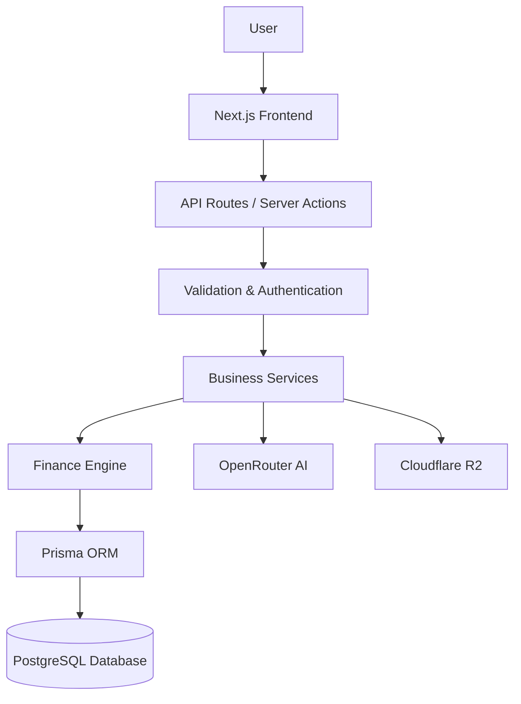
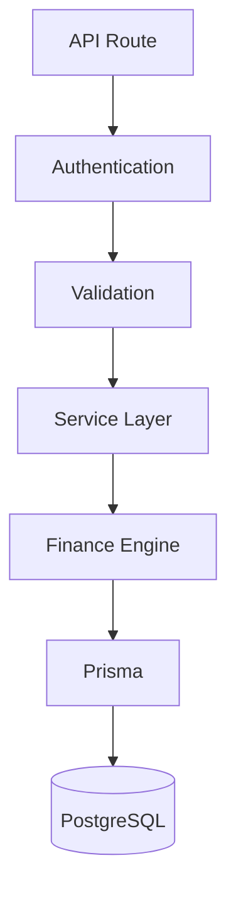
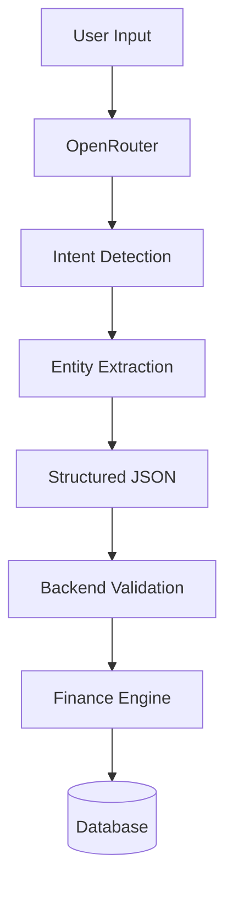
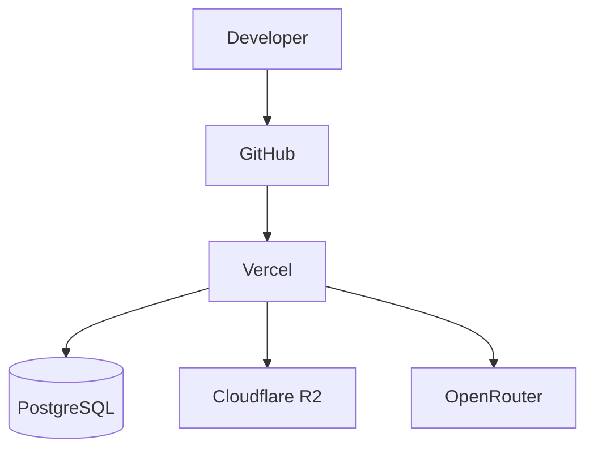

# System Design Document (SDD)

# Budgetly

Version: 1.0

Status: Draft

---

# 1. Introduction

This document defines the complete technical architecture of Budgetly.

It explains how every component of the system interacts, the responsibilities of each layer, and the engineering principles followed throughout the project.

This document acts as the blueprint for implementation.

---

# 2. Design Goals

The architecture should satisfy the following goals.

- Scalable
- Modular
- Maintainable
- Secure
- Production Ready
- AI Independent
- Easy to Test
- Easy to Extend

---

# 3. Engineering Principles

## 3.1 Layered Architecture

Every request should pass through well-defined layers.

UI should never directly access the database.

AI should never directly modify the database.

Business logic should remain independent of the UI.

---

## 3.2 Separation of Concerns

Each layer has exactly one responsibility.

Frontend

↓

Backend API

↓

Business Logic

↓

Database

---

## 3.3 Replaceable Components

Every major component should be replaceable without affecting the rest of the system.

Examples

OpenRouter

↓

Gemini

↓

Claude

↓

Local LLM

Changing the AI provider should not require changes anywhere except the AI module.

The same principle applies to authentication, database, storage and deployment.

---

# 4. High Level Architecture

Budgetly follows a layered architecture where every request passes through a defined set of layers before reaching the database. This separation ensures maintainability, security, and scalability.



### Request Flow

1. User interacts with the frontend.
2. Frontend sends a request to the backend.
3. Backend validates input and authenticates the user.
4. Business Service determines what action should be performed.
5. Finance Engine executes business rules.
6. Prisma communicates with PostgreSQL.
7. Response is returned to the frontend.

For AI-powered requests:

1. User sends text or voice input.
2. OpenRouter converts natural language into structured JSON.
3. Backend validates the AI response.
4. Finance Engine executes the requested operation.
5. Database is updated.
6. Updated result is returned to the user.

---

# 5. System Components

## 5.1 Frontend

The frontend is responsible for presenting data and interacting with users.

Responsibilities:

- Dashboard
- Authentication UI
- Transaction Forms
- Budget Management
- Goal Tracking
- Reports
- Charts
- AI Chat Interface
- Voice Interface
- Settings
- Responsive Design

The frontend never performs business calculations.

---

## 5.2 Backend API

Acts as the communication layer between the frontend and internal services.

Responsibilities:

- Authentication
- Authorization
- Input Validation
- Request Routing
- Error Handling
- Calling Business Services
- Returning Responses

---

## 5.3 Finance Engine

The Finance Engine is the core of Budgetly.

Every financial action passes through this layer.

Responsibilities:

- Transaction Processing
- Budget Calculations
- Goal Calculations
- Analytics
- Report Generation
- Spending Statistics
- Validation Rules
- Duplicate Detection
- Business Logic

The Finance Engine never communicates directly with the user interface.

---

## 5.4 Database

PostgreSQL stores all persistent application data.

Main entities include:

- Users
- Transactions
- Budgets
- Goals
- Categories
- Reports
- Notifications
- AI Conversations
- User Preferences
- Receipt Metadata

---

## 5.5 AI Layer

The AI layer is responsible only for understanding user requests.

Responsibilities:

- Intent Detection
- Entity Extraction
- Language Understanding
- Conversation
- JSON Generation

It is **not allowed** to:

- Insert data into the database
- Delete records
- Modify financial information

Every AI response must pass through backend validation.

---

# 6. Technology Stack

| Layer | Technology | Purpose |
|--------|------------|---------|
| Frontend | Next.js | UI Framework |
| Language | TypeScript | Type Safety |
| Styling | Tailwind CSS | Styling |
| UI Components | shadcn/ui | Accessible Components |
| Backend | Next.js Route Handlers | Backend APIs |
| ORM | Prisma | Database Access |
| Database | PostgreSQL | Persistent Storage |
| Authentication | Better Auth | User Authentication |
| AI | OpenRouter | AI Gateway |
| Validation | Zod | Runtime Validation |
| Storage | Cloudflare R2 | File Storage |
| Deployment | Vercel | Hosting |

---

# 7. Frontend Architecture

The frontend follows a feature-based architecture.

```
App

│

├── Dashboard

├── Transactions

├── Budgets

├── Goals

├── Reports

├── AI

├── Voice

└── Settings
```

Each feature contains:

- Components
- Hooks
- Types
- Utilities
- API Calls

This keeps modules isolated and easy to maintain.

---

# 8. Backend Architecture

Backend follows a layered service architecture.



Each layer has one responsibility and communicates only with adjacent layers.

---

# 9. AI Architecture

Budgetly treats AI as an intelligent parser rather than a decision maker.



Example:

User:

> Yesterday I spent ₹500 on groceries.

AI Response:

```json
{
  "intent": "add_transaction",
  "amount": 500,
  "category": "Groceries",
  "date": "Yesterday"
}
```

The backend validates this JSON before execution.

---

# 10. Voice Processing

Voice interactions follow the same architecture as text.

```
Voice

↓

Speech-to-Text

↓

Language Detection

↓

OpenRouter

↓

Structured JSON

↓

Finance Engine

↓

Database

↓

Response
```

Supported Languages:

- English
- Hindi
- Hinglish

---

# 11. Security Design

Security is integrated throughout the system.

Measures include:

- Authentication
- Authorization
- Password Hashing
- Input Validation
- Rate Limiting
- Secure Cookies
- CSRF Protection
- XSS Prevention
- SQL Injection Prevention
- Environment Variable Validation
- HTTPS Enforcement

Sensitive information is never exposed to the client.

---

# 12. Error Handling

The application follows a centralized error handling strategy.

Every API response follows a consistent structure.

Success:

```json
{
    "success": true,
    "data": {}
}
```

Failure:

```json
{
    "success": false,
    "message": "Invalid transaction amount."
}
```

Errors are logged on the server without exposing sensitive information.

---

# 13. Deployment Architecture



Deployment Process:

1. Push code to GitHub.
2. Vercel builds the project.
3. Database migrations run.
4. Application is deployed.
5. Users access the latest version.

---

# 14. Scalability

Budgetly is designed to support future expansion without major architectural changes.

Future modules include:

- OCR Receipt Scanner
- Bank Synchronization
- Investment Tracking
- Family Accounts
- Shared Wallets
- Tax Planning
- AI Forecasting
- Mobile Applications

These modules can be integrated as independent features while reusing the existing architecture.

---

# 15. Design Decisions

## Why Next.js?

- Unified frontend and backend
- Excellent performance
- Server Components
- Easy deployment on Vercel

---

## Why PostgreSQL?

- Reliable
- ACID compliant
- Excellent relational modeling
- Mature ecosystem

---

## Why Prisma?

- Type-safe database queries
- Easy migrations
- Strong developer experience

---

## Why Better Auth?

- Open-source
- Database ownership
- Flexible authentication options

---

## Why OpenRouter?

- Access to multiple AI models through one API
- Easy provider switching
- Cost optimization
- Vendor independence

---

## Why Layered Architecture?

- Easier maintenance
- Better testing
- Clear separation of responsibilities
- Improved scalability

---

## Why AI Cannot Access the Database?

AI models can make mistakes or produce unexpected output.

Keeping the Finance Engine as the only layer allowed to modify financial data ensures:

- Data integrity
- Security
- Predictable behavior
- Easier debugging
- User trust

This design guarantees that every financial operation is validated before execution.
